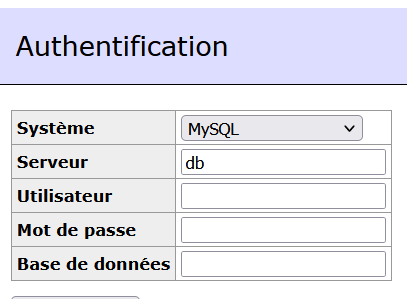
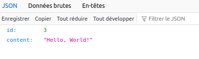
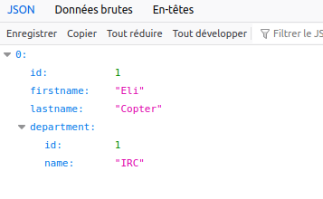
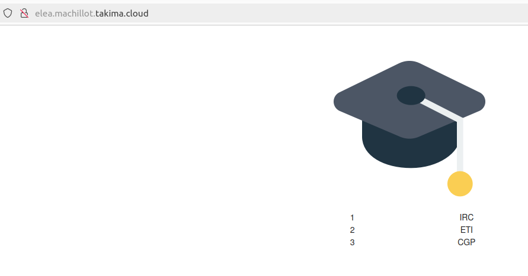
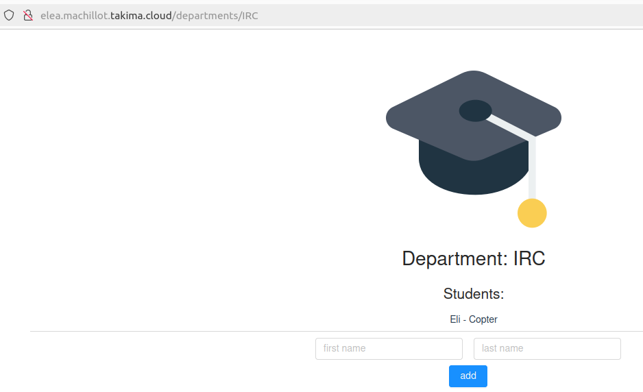

# <p style="text-align:center; color:deeppink">TP 1 - DOCKER</p>
## <p style="text-align:center; color:hotpink">Installation</p>
### <p style="color:pink">Database</p>
Building the image : 

```bash
$ sudo docker build -t premierexercice .
```  

Running the image :  

```bash
$ sudo docker run -v /tmp/DevOps/data:/var/lib/postgresql/data -e POSTGRES_USER=usr -e POSTGRES_PASSWORD=pwd -d --name bd --network app-network premierexercice
```    
 

<br>

### <p style="color:pink">Adminer</p> 
Running adminer : 

```bash
$ sudo docker ps
CONTAINER ID   IMAGE             COMMAND                  CREATED          STATUS          PORTS      NAMES
b23d5993a760   premierexercice   "docker-entrypoint.s…"   37 seconds ago   Up 36 seconds   5432/tcp   bd
```

```bash
$ sudo docker run -d --link suspicious_mirzakhani:db -p 8083:8080 adminer
```

:check: Successfull adminer installation :   


<br>

### <p style="color:pink">Network</p>
Create network so that each app are on the same one: 

```bash
$ sudo docker network create app-network
```


<br>

### <p style="color:pink">Backend API</p>
Building the java image :

```bash
$ sudo docker build -t exodeux .
```

Run the java image :

```bash
$ sudo docker run -it --rm exodeux
```

<br>

### <p style="color:pink">Simple API</p>
Building the image for simpleapi : 

```bash
$ sudo docker build -t simpleapi .
```

Runing the image for simpleapi : 

```bash
$ sudo docker run -it --rm -p 8081:8080 simpleapi 
```

Succesfull Hello World ! from the API :  


<br>

### <p style="color:pink">Backend api with students</p>
Building the image for studentsimpleapi : 

```bash
$ sudo docker build -t simple-api-student .
```

Running the image for studentsimpleapi : 

```bash
$ sudo docker run -dit --rm --name springapi -p 8080:8080  --network app-network simple-api-student 
```

Succesfull API with students now :  



<br>

### <p style="color:pink">HTTP Server</p>
Building the apache image for http : 

```bash
$ sudo docker build -t my-apache2 .
```

Runing the image for http : 
```bash
$ sudo docker run -dit --name my-running-app --network app-network -p 80:80 my-apache2
```

The reverse proxy can now be accessible ! 


<br>

### <p style="color:pink">Docker compose</p>
Build : 

```bash
$ sudo docker compose build
```

Run : 

```bash
$ sudo docker compose up
```


<br>

## <p style="text-align:center; color:hotpink">Questions</p>
**<p style="color:pink">1-1 Document your database container essentials: commands and Dockerfile.</p>**
For commandes, see above, here is the  Dockerfile commented : 

```dockerfile
FROM postgres:14.1-alpine

COPY to-be-copied /docker-entrypoint-initdb.d #Copy what is in to-be-copied onto the entrypoint
```


<br>

**<p style="color:pink">Why do we need a multistage build?</p>**
- Useful to optimize Dockerfiles
- Here it is important if we don't want to have a lot of Dockerfile going on
- Structurate your docker


<br>

**<p style="color:pink">And explain each step of this dockerfile</p>**

```dockerfile
# Build
FROM maven:3.8.6-amazoncorretto-17 AS myapp-build
ENV MYAPP_HOME /opt/myapp
WORKDIR $MYAPP_HOME
COPY pom.xml .
COPY src ./src
RUN mvn package -DskipTests

# Run
FROM amazoncorretto:17
ENV MYAPP_HOME /opt/myapp
WORKDIR $MYAPP_HOME
COPY --from=myapp-build $MYAPP_HOME/target/*.jar $MYAPP_HOME/myapp.jar

ENTRYPOINT java -jar myapp.jar
```

 - FROM ... AS ... we are here naming the stages so that we can reuse them later on
 - MYAPP_HOME is an env pointing to /opt:myapp
 - It became our working directory
 - Then it copy pom.xml, src
 - run "mvn package -DskipTests"
 - Copy onto a jar
 - And finally, configure a container that will run as an executable


<br>

**<p style="color:pink">Why do we need a reverse proxy</p>**
- Prevents malicious person from directly targeting your origin server using its IP address
- Any communication coming from the outside has to go through the reverse proxy first
- Load balancing


<br>

**<p style="color:pink">Why is docker-compose so important?</p>**
- Running multi-container applications
- Efficient development and deployment
- Easy to manage services, networks, and volumes in a single, comprehensible YAML configuration file


<br>

**<p style="color:pink">1-3 Document docker-compose most important commands</p>**

1. ```$ sudo docker compose build``` build images
2. ```$ sudo docker compose up``` start containers
3. ```$ sudo docker compose down``` stop containers/networks/volumes
4. ```$ sudo docker compose start``` start containers
5. ```$ sudo docker compose stop``` stop containers
6. ```$ sudo docker compose restart``` restart container
7. ```$ sudo docker compose logs``` shows logs


<br>

**<p style="color:pink">1-4 Document your docker-compose file.</p>**

```yml
version: '3.8'

services:
    backend:
        container_name: backend #Name we want to give to the container
        build: ./Back/simpleapi/simple-api-student-main #PAth of the Dockerfile 
        networks:
         - app-network #Network used to connect back/db/httpd
         
        depends_on: 
         - database #Can only be up if database is running
        

    database:
        container_name: database #Name we want to give to the container
        build: ./Postgre #PAth of the Dockerfile 
        networks:
         - app-network #Network used to connect back/db/httpd
        volumes:
         - /tmp/DevOps/bd:/var/lib/postgresql/data #Indicate where the volume is located

    httpd:
        container_name: httpd #Name we want to give to the container
        build: ./httpserver  #PAth of the Dockerfile 
        ports: 
         - 80:80 #Port used
        networks:
         - app-network #Network used to connect back/db/httpd
        depends_on: 
         - backend #Can only be up if database is running

networks:
    app-network: 
```

<br>

**<p style="color:pink">1-5 Document your publication commands and published images in dockerhub.</p>**
Connection do dockerhub :

```bash
$ sudo  docker login
```
It will ask you to put your username and password 


Tag images :
```bash
$ sudo  docker ps
CONTAINER ID   IMAGE             COMMAND                  CREATED          STATUS          PORTS                               NAMES
a787321aff14   devops-httpd      "httpd-foreground"       48 minutes ago   Up 48 minutes   0.0.0.0:80->80/tcp, :::80->80/tcp   httpd
e18fea04e787   devops-backend    "/bin/sh -c 'java -j…"   48 minutes ago   Up 48 minutes                                       backend
a7694d6d0b98   devops-database   "docker-entrypoint.s…"   48 minutes ago   Up 48 minutes   5432/tcp                            database
```


```bash
$ sudo  docker tag devops-backend USERNAME/backend:1.0    
$ sudo  docker tag devops-httpd USERNAME/httpd:1.0
$ sudo  docker tag devops-database USERNAME/db:1.0
``` 
With your username


Publish images :

```bash
$ sudo  docker push eleamct/db:1.0
$ sudo  docker push eleamct/backend:1.0
$ sudo  docker push eleamct/httpd:1.0
```


<br>

**<p style="color:pink">Why do we put our images into an online repo?</p>**
- Accessibility from anywhere
- Collaboration
- Versioning


<br>
<br>
<br>

# <p style="text-align:center; color:deeppink">TP 2 - GITHUB</p>
## <p style="text-align:center; color:hotpink">Installation</p>
Building and running tests : 

```bash
mvn clean verify
```
-> it will clear previous builds inside cache and freshly build and run tests.


<br>

## <p style="text-align:center; color:hotpink">Questions</p>
**<p style="color:pink">2-1 What are testcontainers?</p>**
They simply are java libraries that allow you to run a bunch of docker containers while testing. 


<br>

**<p style="color:pink">2-2 Document main.ym</p>**

```yml
name: CI devops 2023
on:
  #to begin you want to launch this job in main and develop
  push:
    branches: [ main, develop ]
  pull_request:
    branches: [ main ]

jobs:
  test-backend: 
    runs-on: ubuntu-22.04
    steps:
     #checkout your github code using actions/checkout@v2.5.0
      - uses: actions/checkout@v2.5.0

     #do the same with another action (actions/setup-java@v3) that enable to setup jdk 17
      - name: Set up JDK 17
        uses: actions/setup-java@v3
        with:
          cache: 'maven'
          java-version: '17'
          distribution: 'temurin'

     #finally build your app with the latest command
      - name: Build and test with Maven
        run: mvn clean verify --file Back/simpleapi/simple-api-student-main/pom.xml

      # define job to build and publish docker image


  build-and-push-docker-image:
    needs: test-backend
    # run only when code is compiling and tests are passing
    runs-on: ubuntu-22.04

    # steps to perform in job
    steps:
      - name: Checkout code
        uses: actions/checkout@v2.5.0

      - name: Login to DockerHub
        run: docker login -u ${{ secrets.HUBUSERNAME }} -p ${{ secrets.HUBPASSWORD }}

      - name: Build image and push backend
        uses: docker/build-push-action@v3
        with:
          # relative path to the place where source code with Dockerfile is located
          context: ./Back/simpleapi/simple-api-student-main
          # Note: tags has to be all lower-case
          tags:  ${{secrets.HUBUSERNAME}}/tp-devops-simple-api:latest
          push: ${{ github.ref == 'refs/heads/main' }}

      - name: Build image and push database
        uses: docker/build-push-action@v3
        with:
          # relative path to the place where source code with Dockerfile is located
          context: ./Postgre
          # Note: tags has to be all lower-case
          tags:  ${{secrets.HUBUSERNAME}}/tp-devops-bd:latest
          push: ${{ github.ref == 'refs/heads/main' }}

      - name: Build image and push httpd
        uses: docker/build-push-action@v3
        with:
          # relative path to the place where source code with Dockerfile is located
          context: ./httpserver
          # Note: tags has to be all lower-case
          tags:  ${{secrets.HUBUSERNAME}}/tp-devops-httpd:latest
          push: ${{ github.ref == 'refs/heads/main' }}
```

 <br>

**<p style="color:pink">Why did we put needs: build-and-test-backend on this job? Maybe try without this and you will see!</p>**
It depends on the successful completion of the test-backend job before it can start


<br>

**<p style="color:pink">For what purpose do we need to push docker images?</p>**
So that the version we push is always the same as the one on docker.


<br>
<br>
<br>

# <p style="text-align:center; color:deeppink">TP 3 - ANSIBLE</p>
## <p style="text-align:center; color:hotpink">Installation</p>
### <p style="color:pink">Ping ansible</p>
```bash
ansible -i /home/elea.machillot/Téléchargements/DevOps/ansible/hosts all -m ping --private-key=id_rsa -u centos
```


### <p style="color:pink">Remote connection</p>
```bash
ssh -i /home/elea.machillot/Téléchargements/id_rsa centos@elea.machillot.takima.cloud
```


### <p style="color:pink">Finish product</p>
On our server called centos@elea.machillot.takima.cloud at the port 80, we can now access to our front !!! :  




<br>

## <p style="text-align:center; color:hotpink">Questions</p>
**<p style="color:pink">3-1 Document your inventory</p>**
```yml 
all:
  # Define SSH user and private key
 vars:
   ansible_user: centos # Set the SSH user to 'centos'
   ansible_ssh_private_key_file: /home/elea.machillot/Téléchargements/DevOps/ansible/id_rsa # Set the path to the SSH private key file

  # Define production hosts
 children:
   prod:
     hosts: elea.machillot.takima.cloud # The hostname of the production server
```


<br>

**<p style="color:pink">3-2 Document your playbook</p>**
Playbook.yml  
```yml
- hosts: all # Apply the 'docker_role' role to all hosts
  gather_facts: false
  become: true
  roles:
   - role: './01-docker_install_role' # Define the 'docker_install_role' role and specify its path.
   - role: './02-network_create_role' # Define the 'network_create_role' role and specify its path.
   - role: './03-database_launch_role' # Define the 'database_launch_role' role and specify its path.
   - role: './04-app_launch_role' # Define the 'dapp_launch_role' role and specify its path.
   - role: './05-proxy_launch_role' # Define the 'procy_launch_role' role and specify its path.
   - role: './06-front_role' # Define the 'procy_launch_role' role and specify its path.
```  

main.yml de docker_role   
```yml 
  # Install device-mapper-persistent-data package using yum
  - name: Install device-mapper-persistent-data
    yum:
      name: device-mapper-persistent-data # Package name
      state: latest # Ensure the latest version is installed

# Install lvm2 package using yum
  - name: Install lvm2
    yum:
      name: lvm2 # Package name
      state: latest # Ensure the latest version is installed

# Add Docker repository using yum-config-manager
  - name: add repo docker
    command:
      cmd: sudo yum-config-manager --add-repo=https://download.docker.com/linux/centos/docker-ce.repo # Add Docker repository

# Install Docker package using yum
  - name: Install Docker
    yum:
      name: docker-ce # Package name
      state: present # Ensure the package is installed

# Install python3 package using yum
  - name: Install python3
    yum:
      name: python3 # Package name
      state: present # Ensure the package is installed

# Install Docker Python package using pip
  - name: Install docker with Python 3
    pip:
      name: docker # Package name
      executable: pip3 # Use pip3 executable
    vars:
      ansible_python_interpreter: /usr/bin/python3

# Ensure Docker service is running
  - name: Make sure Docker is running # Service name
    service: name=docker state=started # Ensure the service is started
    tags: docker # Assign a tag for this task
```

<br>

**<p style="color:pink">Document your docker_container tasks configuration</p>**
***Network***
```yml
- name: Create network
  docker_network:
    name: app-network #Network used to connect back/db/httpd
```

***Database***
```yml
- name: database 
  docker_container:  
    name: "{{postgres_url}}"  # Name of the Docker container 
    image: eleamct/tp-devops-bd:latest  # Docker image 
    pull: yes  # Pull the latest version
    recreate: yes  # Recreate the container if it already exists
    networks:  # Define the networks
      - name: app-network  
    volumes:  # Define volumes to mount in the container
      - /tmp/DevOps/bd:/var/lib/postgresql/data  
    env:  # Define environment variables for the container
      POSTGRES_PASSWORD: "{{ postgres_password }}"  
      POSTGRES_USER: "{{ postgres_user }}" 
      POSTGRES_DB: "{{ postgres_db }}"  
      POSTGRES_URL: "{{ postgres_url }}"  

```

***Backend***
```yml
- name: backend 
  docker_container:  
    name: backend  # Name of the Docker container 
    image: eleamct/tp-devops-simple-api:latest  # Docker image to use for the container
    pull: yes  # Pull the latest version 
    recreate: yes  # Recreate the container if it already exists
    networks:  # Define the networks 
      - name: app-network  
    env:  # Define environment variables for the container
      PASSWORD: "{{ postgres_password }}"  
      USERNAME: "{{ postgres_user }}" 
      DB: "{{ postgres_db }}"  
      URL: "{{postgres_url}}:5432"

```

***Httpd***
```yml
- name: httpd  
  docker_container: 
    name: httpd  # Name of the Docker container 
    image: eleamct/tp-devops-httpd:latest  # Docker image to use for the container
    pull: yes  # Pull the latest version of the image 
    recreate: yes  # Recreate the container if it already exists
    networks:  # Define the networks 
      - name: app-network  
    ports:  # Define port mappings for the container
      - '80:80'  
      - '8080:8080'
```

***Front***
```yml
- name: front  
  docker_container: 
    name: front  # Name of the Docker container 
    image: eleamct/front:latest  # Docker image to use for the container
    pull: yes  # Pull the latest version of the image 
    recreate: yes  # Recreate the container if it already exists
    networks:  # Define the networks 
      - name: app-network  
```